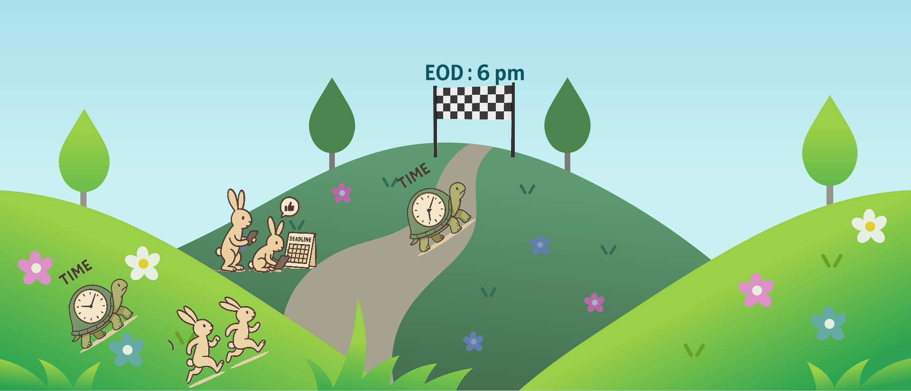

Have you ever felt like time is slipping away faster than it used to? I’ve been feeling this for years. Earlier, I used to think time was *running*. But after Covid, it began to feel like time was *flying*.  

Eventually, I accepted it. Everyone around me kept saying the same thing — *“Time flies.”*  

But today, something made me pause. I got curious and decided to observe my old alarm clock — not the digital one, but the classic analog clock with the hour, minute, and second hands. Every second, it went *tick-tock, tick-tock…*  

You might not believe me, but I got bored after just 30 seconds. Try this for yourself — sit and listen to your clock for half a minute. It feels surprisingly long.  

That’s when it hit me: **time isn’t flying — I’ve just stopped paying enough attention to it.**

---

### 🐢 The Tortoise and the Rabbit of Time

Time is that tortoise — slow, steady, consistent.  

We, on the other hand, are the rabbits — full of excitement at the start, racing ahead, but easily distracted. Meanwhile, time keeps moving at its own pace. By the time we come back to our senses, we’re already behind. And that’s when we sigh, *“Oh God, time just flies.”*  

But the truth is simple: **time doesn’t fly — our attention drifts.**

---

### 💡 The Moral

You lose attention, you lose time.  

And the bigger lesson? If you don’t pay attention to something, you begin to lose it — whether it’s your time, health, wealth, or peace of mind.  

Remember the paper that revolutionized AI: *“Attention Is All You Need.”*  
It’s not just a machine-learning principle — it’s a life principle. Attention is our greatest human asset in this ever-moving world. Yet, we keep giving it away for free.  

---

### 🌱 The Solution

So what can we do?

- **Pay attention** to what truly matters — the present moment, your energy, your health, your money.  
- **Be consistent** like a ticking clock. Don’t rush; keep moving steadily.  
- **Get bored** for at least five minutes a day. Sit still. Do nothing. Let your mind breathe.  
- **Be curious**, not frustrated. Ask *why*, instead of blaming.  
- **Be patient.** Everything meaningful takes time.  

---

### 🕰️ Final Thought

Time doesn’t fly — **our awareness fades.**  

Slow down. Listen to the ticking clock. Pay attention to life as it happens.  
That’s where time slows down — not in the world, but in the mind that’s awake to it.
